# deblend-sofia-detections

`deblend-sofia-detections` is a post-processing tool for H I source detections
created by [SoFiA-2](https://gitlab.com/SoFiA-Admin/SoFiA-2). It is designed for
the case where SoFiA has labelled emission from two or more galaxies as one
source. The package proposes a division of that existing source mask, asks SoFiA
to measure the proposed components, and uses optical/spectroscopic counterparts
to decide whether more than one component should remain.

The package can process a full survey or cluster-field catalogue containing many
normal and blended detections. By default it checks every SoFiA catalogue ID. Use
the optional `source_ids` setting to run a controlled trial on known candidates.

> [!CAUTION]
> The program can overwrite the master SoFiA mask and then rerun SoFiA, which can
> regenerate the catalogue, cubelets, moments, and other enabled products. Work on
> a complete copy of the original SoFiA run, never on your only production copy.

## Contents

- [What problem does it solve?](#what-problem-does-it-solve)
- [Terminology](#terminology)
- [What the program does](#what-the-program-does)
- [Requirements](#requirements)
- [Required SoFiA input](#required-input-from-the-original-sofia-run)
- [Safe working copy](#make-a-safe-working-copy)
- [Quick start](#quick-start-selected-known-blends)
- [Configuration](#important-configuration-settings)
- [Manual optical images and catalogues](#supplying-a-manual-optical-image)
- [Outputs](#understanding-the-output)
- [Scientific quality assurance](#scientific-quality-assurance)
- [Troubleshooting](#troubleshooting)

## What problem does it solve?

An H I data cube has two spatial axes and one spectral/velocity axis. SoFiA finds
significant voxels and stores their source membership in an integer mask. A simple
field might look like this:

```text
data cube voxel values  +  source mask labels  ->  catalogue measurements
```

If two galaxies overlap on the sky and in velocity, SoFiA may connect their
emission and assign all affected voxels to one ID:

```text
connected emission from Galaxy A and Galaxy B -> source ID 42
```

The catalogue then contains one row whose flux, position, spectrum, and velocity
width describe the combined detection. This package attempts to replace that one
mask region with multiple labelled regions:

```text
part of the original mask -> source ID 42
remaining component       -> a new source ID above the old catalogue maximum
```

The measured cube values are not altered. Only voxel ownership in the mask is
changed. Each voxel is assigned wholly to one component; the program cannot assign
fractions of one voxel to several galaxies.

The method is based on the workflow described by
[Huang et al. (2025, ApJ, 980, 157)](https://ui.adsabs.harvard.edu/abs/2025ApJ...980..157H/abstract).

## Terminology

| Term | Meaning in this package |
| --- | --- |
| **Cube** | The original 3-D H I measurement: two sky axes plus a spectral/velocity axis. |
| **Voxel** | One 3-D cube element, equivalent to a pixel in one velocity channel. |
| **Mask** | A 3-D integer array aligned with the cube. Zero is background; each positive integer identifies one SoFiA source. |
| **Catalogue** | The SoFiA table containing one row of measured properties for each mask ID. |
| **Cubelet** | A smaller cube, mask, and set of moments cut around one catalogue source. |
| **Marker** | A seed location representing a possible child galaxy before watershed growth. |
| **Watershed** | A segmentation algorithm that grows labelled regions from markers until they meet. |
| **Counterpart** | An optical or spectroscopic galaxy associated with a proposed H I component. |

The parent detection is the original SoFiA source. The children are the proposed
sources created by dividing that parent's mask.

## What the program does

For each selected SoFiA source, the current pipeline performs the following steps:

1. It opens the source cubelet, source mask, and moment-0 map from the existing
   SoFiA run.
2. It obtains a field-wide optical image. The default is DSS2 Red from SkyView;
   a WCS-aware optical FITS image can be supplied instead.
3. For each source, it makes an optical cutout, estimates and subtracts the
   background, attempts to mask Gaia DR3 stars, smooths the image, and detects
   optical objects inside the H I footprint.
4. It uses the optical objects as markers for a watershed segmentation of either
   the full H I cube (default) or the moment-0 map.
5. If peak deblending is enabled, it finds significant local H I maxima and runs
   a second 3-D watershed. The number of peak markers is capped by
   `maximum_no_peaks`.
6. It chooses a candidate mask in this order: successful peak-based 3-D mask,
   successful optical 3-D mask, then successful optical 2-D mask.
7. It calls the separate `sofia` executable with the S+C finder, linking,
   reliability filtering, and dilation disabled. The bundled trial template also
   has threshold finding disabled, so SoFiA measures the proposed labelled
   components rather than rediscovering sources.
8. It searches NED and any supplied manual counterpart tables. Proposed components
   without a suitable counterpart may be merged back together.
9. If more than one viable component remains, it inserts the relabelled source mask
   into the master field mask.
10. After all selected IDs have been checked, it reruns SoFiA on the complete field
    mask if at least one split was accepted.

```mermaid
flowchart LR
    A["Existing SoFiA cube, mask, catalogue, and cubelets"] --> B["One selected source ID"]
    B --> C["Optical markers and H I peak markers"]
    C --> D["2-D or 3-D watershed masks"]
    D --> E["SoFiA re-parameterises proposed children"]
    E --> F["NED and manual-counterpart checks"]
    F --> G["Accepted child labels enter the master mask"]
    G --> H["SoFiA re-parameterises the complete field"]
```



This is an automated proposal and filtering pipeline, not a definitive
astrophysical blend classifier. Every accepted split still needs scientific
inspection.

## What it does not do

- It does not run initial H I source finding. You must complete a normal SoFiA run
  first.
- It does not discover emission outside the existing parent source mask.
- It does not guarantee that multiple H I peaks correspond to multiple galaxies.
- It does not guarantee that an optical object owns the nearest H I emission.
- It does not fractionally divide unresolved voxels.
- It does not remove the need to inspect channel maps, spectra, moment maps, and
  counterparts.

A rotating disc can have several H I peaks or a double-horned spectrum. Disturbed
gas, tidal bridges, and ram-pressure-stripped tails can also be offset from their
stellar counterparts. In such cases, “unresolved” or “reject the split” can be the
correct scientific conclusion.

## Requirements

### Python package

- Python 3.11 or later
- The Python dependencies declared in `pyproject.toml`

Install the released package in a virtual environment:

```bash
python3.11 -m venv deblend_venv
source deblend_venv/bin/activate
python -m pip install --upgrade pip
python -m pip install deblend_sofia_detections
```

For development from this repository:

```bash
git clone https://github.com/PeterKamphuis/deblend_sofia_detections.git
cd deblend_sofia_detections
python3.11 -m venv .venv
source .venv/bin/activate
python -m pip install --upgrade pip
python -m pip install -e .
```

An editable install is the right choice when testing changes from this checkout,
including configuration features that have not yet appeared in a packaged release.

Confirm that the command is installed:

```bash
deblend -v
```

### SoFiA-2 executable

SoFiA is a separate program. Installing this Python package does **not** install
SoFiA. The executable must be available when candidate components and the final
field are parameterised.

```bash
command -v sofia
```

If the executable has another name or is not on `PATH`, set it explicitly:

```yaml
internal:
  sofia: /absolute/path/to/sofia
```

On a cluster, SoFiA may first need to be loaded through the local module system.

### Network access

The default workflow accesses:

- SkyView for a DSS2 Red image, unless a manual optical FITS image is supplied;
- Gaia DR3 for foreground-star masking; and
- NED for counterpart matching.

Gaia and NED failures have limited fallbacks, but reliable counterpart information
is central to deciding whether a proposed split survives. For crowded fields,
supplying a vetted manual spectroscopic catalogue is strongly recommended.

## Required input from the original SoFiA run

Use the **exact SoFiA parameter file used for the full field whose detections you
want to deblend**. Do not use the generic `sofia_template.par` as the input for an
existing run.

The deblender reads these values from your original `.par` file:

```text
input.data
output.directory
output.filename
```

Those settings must resolve to the original cube and the corresponding SoFiA
products. If `output.filename = cluster`, the expected layout is approximately:

```text
working_copy/
├── cluster_sofia.par
├── cluster_cube.fits
└── sofia_output/
    ├── cluster_cat.xml          # cluster_cat.txt is also supported
    ├── cluster_mask.fits        # full-field labelled mask
    ├── cluster_mom0.fits        # full-field moment-0 map
    └── cluster_cubelets/
        ├── cluster_1_cube.fits
        ├── cluster_1_mask.fits
        ├── cluster_1_mom0.fits
        ├── cluster_2_cube.fits
        ├── cluster_2_mask.fits
        ├── cluster_2_mom0.fits
        └── ...
```

The original SoFiA run therefore needs catalogue, mask, moment, and cubelet output
enabled. Standard parameterised SoFiA catalogues should contain the fields used by
the deblender, including source ID, sky position, velocity, flux, source bounds,
ellipse measurements, and noise/width measurements.

### Which `.par` file should I use?

| Parameter file | Use it? | Reason |
| --- | --- | --- |
| The `.par` used to detect the complete cluster or survey field | Yes | It points to the master cube and all existing SoFiA products. |
| A `.par` from a deliberately isolated one-source SoFiA run | Only for that isolated test | The deblender will only know about products from that run. |
| The generated `sofia_template.par` | No | It is an internal template for measuring proposed child masks. |
| The generated `deblend_sofia.par` | No | The program creates it when re-parameterising the updated field mask. |

## Make a safe working copy

Copy the cube, original `.par` file, catalogue, mask, moment maps, and cubelet
directory into a trial workspace. Preserve an untouched baseline separately.

```bash
cp -a /data/cluster_sofia_run /data/cluster_deblend_trial
cd /data/cluster_deblend_trial
```

Inspect the copied `.par` file:

```bash
rg -n '^\s*(input\.data|output\.directory|output\.filename)\s*=' cluster_sofia.par
```

Update absolute paths that still point at the production output. A safe copied file
might contain:

```text
input.data = /data/cluster_deblend_trial/cluster_cube.fits
output.directory = /data/cluster_deblend_trial/sofia_output
output.filename = cluster
output.overwrite = true
```

The data cube may remain in a shared read-only location, but `output.directory`
must point to the copied SoFiA products. Relative output paths are resolved from
the input cube directory by the current code, so absolute paths are safest. The
final rerun preserves the original SoFiA output settings; in the working copy,
`output.overwrite` must permit those products to be regenerated.

For an additional before/after comparison:

```bash
mkdir -p baseline
cp sofia_output/cluster_cat.xml baseline/cluster_cat_before.xml
cp sofia_output/cluster_mask.fits baseline/cluster_mask_before.fits
```

## Quick start: selected known blends

The safest first run is a small allowlist of known candidate blends.

Create `cluster_deblend.yml`:

```yaml
input:
  # This is the original full-field SoFiA parameter file in the working copy.
  sofia_parameters: /data/cluster_deblend_trial/cluster_sofia.par

  # Quote IDs. Remove this block or use [] to process the entire catalogue.
  source_ids:
    - "42"
    - "57"
    - "221"

  use_optical_deblending: true
  use_cube_deblending: true
  use_peak_deblending: true
  maximum_no_peaks: 5
  compactness: 0.0

general:
  verbose: true
  ncpu: 1
  optical_pixel_scale: 5.0
  counterpart_region: Ellipse
  debug: true

directories:
  run_directory: /data/cluster_deblend_trial
  ancillary_directory: /data/cluster_deblend_trial/ancillary_data
  watershed_directory: /data/cluster_deblend_trial/Watershed_Output
```

Run it and keep a log:

```bash
source deblend_venv/bin/activate
cd /data/cluster_deblend_trial
deblend configuration_file=/data/cluster_deblend_trial/cluster_deblend.yml \
  2>&1 | tee cluster_deblend.log
```

Configuration and command-line values use OmegaConf `key=value` syntax, not
traditional `--key value` options. A setting can be overridden for one run:

```bash
deblend configuration_file=cluster_deblend.yml \
  general.debug=true \
  input.maximum_no_peaks=3 \
  input.compactness=0.0
```

The override does not edit the YAML file. Record the exact command used for each
scientific trial.

## Running the complete catalogue

An omitted or empty `source_ids` list preserves the original behavior and attempts
every catalogue detection:

```yaml
input:
  sofia_parameters: /data/cluster_deblend_trial/cluster_sofia.par
  source_ids: []
```

Normal detections are allowed in the same field as blends. The code checks them
one at a time and only updates the master mask when a candidate remains split after
the measurement and counterpart stages. This automated screening can still make
false positive or false negative decisions, so review every changed source.

For a large cluster field, begin with a short allowlist. Once the configuration,
optical image, counterpart table, and QA procedure are validated, expand the list
or remove it.

## Generate the packaged examples

Run the following command in a disposable or configuration directory:

```bash
deblend print_examples=true
```

It writes:

- `deblend_sofia_detections_default.yml`, containing current user-facing defaults;
- `sofia_template.par`, the generic internal SoFiA measurement template.

The command exits after writing the files. The template is useful for inspection,
but it is not a replacement for the `.par` file from your original SoFiA run.

## Important configuration settings

### Input settings

| Setting | Default | Meaning |
| --- | --- | --- |
| `input.sofia_parameters` | `sofia_input.par` | Original `.par` file for the complete SoFiA run being deblended. |
| `input.source_ids` | `[]` | Optional catalogue-ID allowlist. Empty means all IDs. Unknown IDs stop before source processing. |
| `input.manual_input_tables` | `[null]` | Optional `.csv`, `.txt`, or compatible pickled counterpart tables. |
| `input.manual_markers_only` | `false` | When `true`, only manual catalogue positions inside the parent H I mask seed optical watershed runs; automatic optical detections remain QA diagnostics. Requires a manual input table. |
| `input.manual_optical_image` | `[null]` | Optional celestial-WCS optical FITS image. A 2-D image is used directly; multi-plane images are collapsed over non-celestial axes. Only the first image is currently used. |
| `input.original_tables` | `false` | Reread supplied text tables instead of using cached pickle files. This is not a backup/safety option. |
| `input.original_images` | `false` | Recreate cached optical products from the supplied image or SkyView. This is not a backup/safety option. |
| `input.use_optical_deblending` | `true` | Detect optical markers and try an optical watershed split. |
| `input.use_cube_deblending` | `true` | Use the 3-D cube for optical-marker watershed; `false` uses the 2-D moment-0 map. |
| `input.use_peak_deblending` | `true` | Try the H I local-peak 3-D watershed and prefer it when successful. |
| `input.maximum_no_peaks` | `5` | Maximum H I peak markers retained for one parent source. |
| `input.compactness` | `0.0` | Watershed compactness penalty. Start at zero for extended/disturbed H I. |

### General settings

| Setting | Default | Meaning |
| --- | --- | --- |
| `general.verbose` | `true` | Print progress and decisions. Keep enabled during initial trials. |
| `general.ncpu` | available CPUs | Number passed to the peak-finding interface. The current fast local-maximum implementation itself is not parallelised. |
| `general.multiprocessing` | `true` | Reserved multiprocessing preference. The current main source loop does not branch on this setting. |
| `general.continue_on_source_error` | `true` | Record a source-level exception and continue with the next selected ID. |
| `general.optical_pixel_scale` | `5.0` | Requested number of optical pixels across the H I beam; downloaded pixels are capped at 4 arcsec. |
| `general.counterpart_region` | `Ellipse` | Spatial region used for counterpart matching. Supported choices include `Beam`, `3Beam`, `Box`, `Ellipse`, and `Full_Ellipse`. |
| `general.debug` | `false` | Write additional diagnostic products, including a per-source optical/H I/catalogue QA plot. **This is not a dry-run mode.** |

### Directory settings

| Setting | Default | Meaning |
| --- | --- | --- |
| `directories.run_directory` | current directory | Directory in which processing runs. It must already exist. |
| `directories.ancillary_directory` | `ancillary_data` | Cached optical images, cleaned cutouts, tables, and debug material. |
| `directories.watershed_directory` | `Watershed_Output` | Per-source watershed and trial-SoFiA products. |

The `sofia` configuration section is populated from the original `.par` file and
normally should not be set manually. `internal.sofia` is the useful exception when
the SoFiA executable is not simply named `sofia`.

### Source-level failure handling

An exception raised while processing one cubelet is recorded and the run continues
with the next selected SoFiA ID by default. At the end of every run,
`Watershed_Output/deblend_failures.log` contains the source ID, cubelet path,
exception type, reason, and full traceback for every failed attempt. The file is
overwritten on each run, including successful runs, so an old failure report cannot
be mistaken for the current result.

A source that completes normally without being split is counted as successful.
Only an uncaught exception is recorded as a failure. To stop at the first exception,
set:

```yaml
general:
  continue_on_source_error: false
```

## Supplying a manual optical image

Set a FITS image with valid celestial WCS that overlaps the full SoFiA moment-0
field:

```yaml
input:
  manual_optical_image:
    - /data/cluster_deblend_trial/optical/r_band.fits
  original_images: true
```

The program cuts the image to the SoFiA field and stores processed products in the
ancillary directory. After the first successful run, set `original_images: false`
to reuse the cached image. Set it back to `true` after replacing the optical FITS
or when you intentionally want to rebuild all processed cutouts.

A manual image must contain a valid celestial WCS. Two-dimensional FITS images
are used directly. For an RGB, RGBA, or other multi-plane image, the program
identifies the two celestial axes from the WCS and averages every non-celestial
array axis to form a grayscale 2-D image before making the cutout. The log records
the original shape and collapsed axes. If the celestial axes cannot be identified,
the file contains no suitable image HDU, or it does not overlap the SoFiA field,
the run stops with an explicit input error rather than the less informative
Astropy dimension-mismatch traceback.

### Standalone optical FITS converter

The repository includes `scripts/convert_optical_fits_to_2d.py` for converting
an optical image before running the deblender. It accepts any FITS image with at
least two dimensions and a celestial WCS. The default operation averages all
non-celestial planes. Supplying only the input creates `<input>_2d.fits` in the
same directory:

```bash
python scripts/convert_optical_fits_to_2d.py \
  "/data/Abell-548-colour.fits"
```

This writes `/data/Abell-548-colour_2d.fits`. An explicit output path is also
supported:

```bash
python scripts/convert_optical_fits_to_2d.py \
  "/data/Abell-548-colour.fits" \
  "/data/Abell-548-optical-2d.fits"
```

For a more outlier-resistant collapse, use the median:

```bash
python scripts/convert_optical_fits_to_2d.py \
  input.fits output_2d.fits \
  --method median
```

Use `--method first` to select the first plane along every non-celestial axis,
`--hdu 1` (or an extension name) to choose a specific image HDU, and
`--overwrite` to replace an existing output file. The script never allows the
input path itself to be overwritten. It writes a float32 image by default,
retains the celestial WCS and useful observing metadata, records the conversion
in FITS `HISTORY`, and verifies that the written result is two-dimensional.

Point the YAML at the converted file and rebuild the cached optical products:

```yaml
input:
  manual_optical_image:
    - /data/Abell-548-optical-2d.fits
  original_images: true
```

## Supplying a manual counterpart table

Manual counterparts are especially valuable in crowded clusters where automatic
database matching may be incomplete or ambiguous. A CSV must provide a commented
column-name row followed by a commented unit row. For example:

```csv
# Name,RA,DEC,Velocity,PA,sma,smb
# -,deg,deg,km/s,deg,arcsec,arcsec
Galaxy_A,150.123400,-26.123400,14500,45,18,10
Galaxy_B,150.128100,-26.120700,14620,112,13,8
```

Configure it with:

```yaml
input:
  manual_input_tables:
    - /data/cluster_deblend_trial/catalogues/counterparts.csv
  # Optional: exclude automatic Photutils detections from watershed markers.
  manual_markers_only: true
  original_tables: true
```

With `manual_markers_only: true`, the manual table acts as the optical-marker
allowlist. Every catalogue entry whose marker overlaps the parent H I footprint
can seed the watershed; use a table containing only the counterparts intended
for the selected blends. Automatic Photutils detections are still shown as cyan
QA outlines and crosses, but they are not watershed seeds. Catalogue positions
outside the parent H I footprint can still appear as yellow QA dots and are not
used as markers. The QA image title reports the active watershed-marker mode.

The important fields are:

- `Name`: stable counterpart identifier;
- `RA`, `DEC`: sky position, normally in decimal degrees;
- `Velocity`: spectroscopic systemic velocity, normally in km/s;
- `PA`: optional optical position angle;
- `sma`, `smb`: optional semi-major and semi-minor marker sizes.

Accepted aliases exist for several velocity and size columns, but explicit names
and units are safest. Check carefully for redshift versus velocity, m/s versus
km/s, degrees versus sexagesimal coordinates, arcseconds versus arcminutes, and
semi-axis versus full diameter.

The loader caches text/CSV tables as `.pkl` files. After editing a source table,
use `original_tables: true` for the next run so the text is reread. It can then be
returned to `false` to reuse the cache.

## Understanding the output

With default directories, source ID 42 produces a directory similar to:

```text
sofia_output/
└── Watershed_Output/
    └── watershed_source_42/
        ├── deblended_cube_mask_based_on_optical.fits
        ├── deblended_moment0_mask_based_on_optical.fits
        ├── deblended_cube_mask_based_on_peaks.fits
        ├── final_mask.fits
        ├── utilized_mask.fits
        ├── Sofia_Output/
        │   ├── sofia_input.par
        │   ├── ..._cat.xml
        │   ├── ..._mask.fits
        │   └── ..._cubelets/
        └── debug_products/
            ├── optical_hi_catalogue_overlay_source_42.png
            ├── optical_hi_components_overlay_source_42.png
            └── catalogue_positions_source_42.ecsv
```

Not every file appears for every source:

- `deblended_*_based_on_optical.fits` files are candidate optical-marker masks;
- `deblended_cube_mask_based_on_peaks.fits` is the H I peak candidate;
- `final_mask.fits` can be written while unmatched components are merged;
- `utilized_mask.fits` is the relabelled accepted mask inserted into the master
  field mask;
- `Sofia_Output/` contains the temporary SoFiA measurement of proposed children;
- `debug_products/` exists when `general.debug: true` and contains intermediate
  markers, smoothed cubes, watershed diagnostics, and a per-source QA image. In
  `optical_hi_catalogue_overlay_source_<ID>.png`, the optical cutout is the
  grayscale background, the original H I footprint is purple, faint lavender
  contours show moment-0 intensity, cyan outlines and crosses mark automatically
  detected optical sources, and yellow dots mark manual or accepted NED catalogue
  positions. `catalogue_positions_source_<ID>.ecsv` records the catalogue name,
  object name, RA, and Dec for every yellow dot. If no catalogue position falls
  inside the cutout, the table is empty and the plot says so explicitly.
- `optical_hi_components_overlay_source_<ID>.png` retains the same optical,
  parent-H I, optical-detection, and catalogue context, then adds one distinct
  contour colour for every child from the first trial SoFiA parameterisation.
  A matching coloured circle and label mark the child's SoFiA catalogue RA/Dec.
  These are raw candidate children shown before counterpart-based merging or
  rejection; they are not confirmation of separate galaxies or accepted final
  catalogue sources.

The QA plot is first written immediately after optical-source detection and is
updated after counterpart matching. Consequently, an early plot is normally
still available if a later watershed or trial-SoFiA step fails. Plotting errors
are reported as warnings and do not fail or skip the scientific source
processing.

If at least one split is accepted, the code also:

1. overwrites the copied full-field `<basename>_mask.fits` with the new labels;
2. writes `deblend_sofia.par` next to the original parameter file; and
3. reruns SoFiA on the complete updated mask using the original output settings.

The final catalogue and other enabled products therefore remain field-level SoFiA
outputs, including all unchanged detections and any new child IDs.

## Scientific quality assurance

Finding `utilized_mask.fits` means a split survived the software's internal path;
it does not prove that the split is physically correct.

For every changed source, inspect the original parent and proposed children in a
3-D viewer such as CARTA or a combination of DS9 and spectral/PV tools. At minimum:

1. Display mask IDs using discrete colours or integer contours.
2. Overlay the masks on the optical image and H I moment-0 map.
3. Step through individual velocity channels.
4. Inspect moment-1/velocity maps and a position-velocity diagram.
5. Compare each child spectrum with the original parent spectrum.
6. Check positions and systemic velocities against the proposed counterparts.
7. Repeat reasonable configurations, especially peak limits and the choice of
   peak versus optical-only deblending.

A plausible child should be spatially coherent over consecutive channels, span a
meaningful number of resolution elements, have a sensible spectrum and velocity,
and correspond to a credible galaxy. Warning signs include:

- a component present in only one channel;
- a marker located on a foreground star or unrelated projected object;
- a normal rotating disc split into two horns or bright clumps;
- a boundary that cuts abruptly across continuous velocity structure;
- a tidal or stripped tail changing ownership after a small parameter change;
- large disagreement between optical and peak-based masks; or
- a child with no credible positional and velocity counterpart.

Check approximate integrated-flux conservation:

```text
fractional difference = abs(sum(child fluxes) - parent flux) / abs(parent flux)
```

Good flux agreement is necessary but not sufficient. The total can be conserved
while emission is assigned to the wrong child.

A useful review classification is:

- **Accept**: coherent and well-supported split;
- **Accept with caveat**: useful division with a documented ambiguity;
- **Reject**: likely over-segmentation or incorrect assignment;
- **Unresolved**: available resolution does not support a defensible division.

## Troubleshooting

### `deblend` is not found

Activate the virtual environment and confirm the installation:

```bash
source deblend_venv/bin/activate
python -m pip show deblend_sofia_detections
command -v deblend
```

### `sofia` is not found

SoFiA must be installed or loaded separately:

```bash
command -v sofia
```

If needed, set `internal.sofia` to the executable's absolute path. A failed SoFiA
subprocess writes `sofia_output.txt` in the relevant SoFiA run directory.

### The catalogue or cubelets cannot be found

Check the three path-defining settings in the copied `.par` file:

```bash
rg -n '^\s*(input\.data|output\.directory|output\.filename)\s*=' cluster_sofia.par
```

Then verify the expected products:

```bash
ls sofia_output/cluster_cat.xml
ls sofia_output/cluster_mask.fits
ls sofia_output/cluster_mom0.fits
ls sofia_output/cluster_cubelets/cluster_42_cube.fits
ls sofia_output/cluster_cubelets/cluster_42_mask.fits
ls sofia_output/cluster_cubelets/cluster_42_mom0.fits
```

If these do not exist, regenerate the original SoFiA run with catalogue, mask,
moments, and cubelets enabled.

### A requested source ID is rejected

`source_ids` must match IDs in the original SoFiA catalogue. IDs should be quoted
in YAML. The error lists requested IDs that are absent.

### A known blend is not split

Possible causes include:

- only one usable optical marker was detected;
- too few significant H I peaks survived the size/beam checks;
- proposed children were merged because counterparts were not found;
- the optical image is too shallow, poorly registered, or contaminated;
- the original SoFiA mask does not contain enough emission to separate the objects.

Retry with `general.debug: true`, inspect the marker and candidate-mask products,
and consider a manual optical image or counterpart table. Do not treat increasing
`maximum_no_peaks` as proof that additional components are real.

### Changes to a catalogue or optical image are ignored

Set the corresponding refresh option for one run:

```yaml
input:
  original_tables: true
  original_images: true
```

These settings refresh cached inputs. They do not make the run non-destructive and
do not protect the master SoFiA products.

### The full-field run is slow

Use `source_ids` to validate a small candidate list first. Disable debug products
after the workflow is understood, reuse cached optical/table products, and only
then expand to the complete catalogue.

## Reproducibility checklist

Before a production run, record:

- package version from `deblend -v`;
- SoFiA version and executable path;
- the original and generated SoFiA parameter files;
- the deblender YAML and exact command line;
- source IDs attempted;
- manual table and optical-image versions;
- baseline catalogue and mask checksums;
- per-source QA classification and notes.

## Further documentation and development status

- [Advanced configuration reference](docs/source/Advanced.rst)
- [SoFiA-2 project](https://gitlab.com/SoFiA-Admin/SoFiA-2)
- [Method paper](https://ui.adsabs.harvard.edu/abs/2025ApJ...980..157H/abstract)

The package is currently marked beta. Most of the implementation is adapted from
the workflow accompanying the method paper, and Qifeng Huang should be considered
a principal author of the underlying method and code lineage.

Bug reports and focused improvements are welcome through the
[GitHub repository](https://github.com/PeterKamphuis/deblend_sofia_detections).
